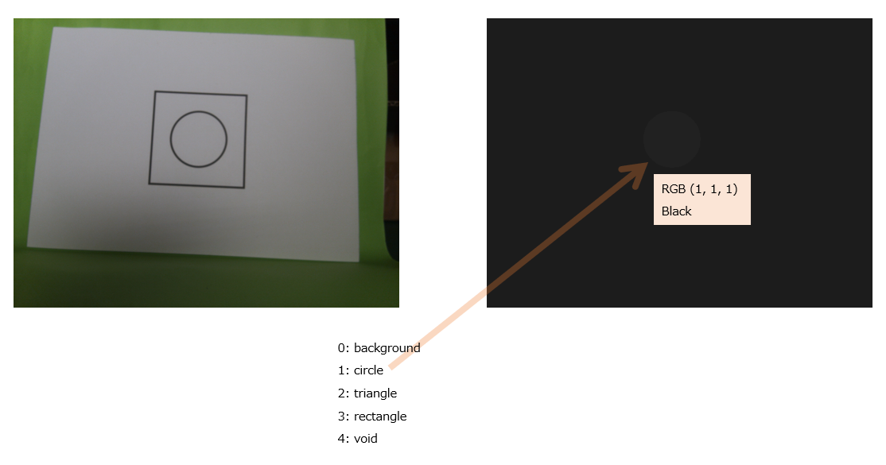

# New Dataset of imx500_zoo DeepLab

## Introduction

To use a new dataset with DeepLab, you need the dataset files and to modify the configuration files.
The new dataset has new CLASSES and new LAVEL_IMAGES.
The path to the dataset has changed.

#### Folder structure

Folder structure of datasets should be as follows:
```
Datasets
└── train
      ├── JPEGimages
      ├── SegmentationClassRaw
      └── label_data.txt
    valid
      ├── JPEGimages
      ├── SegmentationClassRaw
      └── label_data.txt
    test
      ├── JPEGimages
      ├── SegmentationClassRaw
      └── label_data.txt
```

- The JPEGimages folder consists images in JPEG format with ".jpg" extention.
- The SegmentationClassRaw folder consits label images in PNG format with ".png" extention. 
- The label_data.txt file lists file names without extensions, one per line. Based on a single file name, it references two files: one JPEG file and one PNG file. 
For example, if label_data.txt contains "001", it references the files JPEGimages/001.jpg and SegmentationClassRaw/001.png.

#### CLASSES
CLASSES is the number of objects to be detected plus 2. The 0 index represents the background, and the last index is designated as void. Classes start from 0 and are sequentially numbered with an increment of 1. 

For example, if there are three object classes: circle, triangle, and rectangle, the mapping would be below:
```
 circle
 traiangle
 rectangle
 -->
 0: background
 1: circle
 2: triangle
 3: rectangle
 4: void
```

[PASCAL VOC2011 Example Segmentations](http://host.robots.ox.ac.uk/pascal/VOC/voc2012/segexamples/index.html)

#### LAVEL_IMAGES

The LAVEL_IMAGES are colored with class numbers indicating the parts to be detected. The RGB values are the same, with the class number represented as the value. 

For example, the "circle" class is represented by the number 15, and its RGB value is (1, 1, 1).



## Files to Modify
```
mandatory
 1 LAVEL_IMAGES files of dataset
 2 INI file
 3 YAML file

optional
 4 card_segmentation.py
 5 deeplab_v3p_trainer.py
```

### Mandatory Modifications

#### 1. LAVEL_IMAGES files of dataset in samples/data/

##### 1.1. **Defining a New Class**
   - To add a new class, first decide on the class name (e.g., "tree" or "building").
   - Assign a unique class ID that does not overlap with existing class IDs. Class IDs are typically managed as consecutive integers starting from 0.

##### 1.2. **Creating Annotations**
   - For each image, manually or using tools, create segmentation masks for the new class.

##### 1.3. **Updating Annotation Files**
   - Add the newly created annotations to the existing dataset annotation folder (`SegmentationClassRaw/`).

##### 1.4. **Maintaining Dataset Structure**
   - Follow the dataset structure and place the images for the new class in the appropriate folders:
     - **Image folder**: `JPEGImages/`
     - **Segmentation masks**: `SegmentationClassRaw/`

#### 2. INI file in samples/

- Change NUM_CLASSES in the [MODEL] section to the number of CLASSES + 1.
```ini
NUM_CLASSES = 23
```

- Update CONFIG in the [TRAINER] section to the path of the YAML file.
```ini
CONFIG = ./config/deeplab_card.yaml
```

#### 3. YAML file in samples/config/

In the "model_param" section :

- Change "classes" to the new class IDs and names.

```yaml
    model_param: {  
        classes: {
            0: "background", # first is always background
            1: "aeroplane",
            2: "bicycle",
            3: "bird",
            4: "boat",
            5: "bottle",
            6: "bus",
            7: "car",
            8: "cat",
            9: "chair",
            10: "cow",
            11: "diningtable",
            12: "dog",
            13: "horse",
            14: "motorbike",
            15: "person",
            16: "pottedplant",
            17: "sheep",
            18: "sofa",
            19: "train",
            20: "tvmonitor",
            21: "tree",
            22: "building",
            23: "void", # last is always void, as len() = num_class + 1
        }
    }
```

- Update path to the root of the new dataset files.
```yaml
    data_rootpath: "./data/CardSegmentation/card"
```

### Optional Modifications

#### 4. src/imx500_zoo/datasets/card_segmentation.py
The augmentaion of training can be modified.
```python
     self.trainloader = Segmentation(
            config=self.config,
            dir=self.d_root,
            batch_size=self.batchsize,
            resize_shape=self.imagesize,
            blur=5,
            crop_shape=None,
            mode="train",
            n_classes=self.nclass,
            h_flip_en=True,
            v_flip_en=False,
            brightness=0.3,
            rotation=False,
            zoom=0.1,
            seed=7,
            contrast_en=False,
        )
```        

The augmentaion of root source is below:
src/imx500_zoo/utilities/deeplab_v3p/segmentation.py :

The [Augmentation setting](https://albumentations.ai/docs/getting_started/transforms_and_targets/) can be modified.
- `rotation=180,` is very strong transformations and can be removed if necessary.
```python
    def get_pipeline(
        self,
        blur,
        resize_shape,
        crop_shape,
        h_flip_en,
        v_flip_en,
        brightness,
        rotation,
        zoom,
        contrast_en,
        pr=0.5,
    ):
        """
        generate pipeline for augmentation
        """
        pipeline = []
        if blur:
            pipeline.append(GaussianBlur(blur_limit=(blur, blur), p=pr))
        if resize_shape and not crop_shape:
            pipeline.append(
                Resize(
                    height=resize_shape[1],
                    width=resize_shape[0],
                    interpolation=cv2.INTER_AREA,
                )
            )
        if crop_shape:
            pipeline.append(RandomCrop(height=crop_shape[1], width=crop_shape[0]))
        if h_flip_en:
            pipeline.append(HorizontalFlip(p=pr))
        if v_flip_en:
            pipeline.append(VerticalFlip(p=pr))
        if brightness:
            pipeline.append(
                RandomBrightnessContrast(
                    brightness_limit=[-brightness, brightness], contrast_limit=0, p=pr
                )
            )
        if rotation or zoom:
            pipeline.append(
                Affine(
                    scale=(1 - zoom, 1 + zoom),
                    rotate=(-rotation, rotation),
                    keep_ratio=True,
                    p=pr,
                )
            )
        if contrast_en:
            pipeline.append(CLAHE(clip_limit=2.0, tile_grid_size=(8, 8), p=pr))

        return pipeline
``` 

#### 5. src/imx500_zoo/trainers/deeplab_v3p_trainer.py

The value of [patience](https://keras.io/api/callbacks/early_stopping/) can be modified.
```python
       stop_train = EarlyStopping(
            monitor="val_{}".format(monitor),
            patience=100,
            verbose=1,
            mode=mode,
        )
```

The [Adam](https://keras.io/api/optimizers/adam/) options can be modified.
```python
        model.compile(
            optimizer=Adam(learning_rate=7e-4, epsilon=1e-8, weight_decay=1e-6),
            sample_weight_mode="temporal",
            loss=losses,
            metrics=metrics,
        )
```

